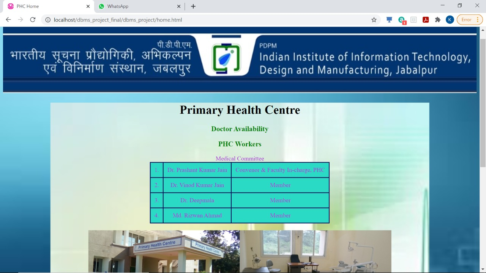
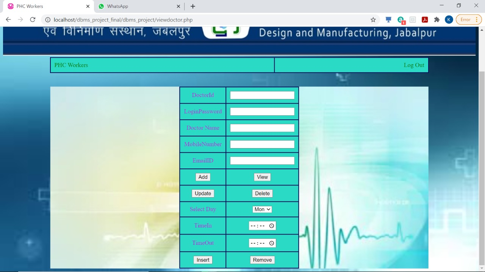

# Dbms_project
Project based on primary health centre, which reduces paper work, maintain details of medicine stock, time table of doctor, and details of patients, doctors and compounders.
 
Home page
 

To check doctor availabilty
 

Doctors available
 

Login page
 

If all medicine are in stock
 

When medicines are not in stock, warning message appear
 

Medicines which are out of stock.
 

All Medicine details 
 

To add patient
 

To add doctor and  to change their time table
 

To add compounder and to change their time table
 

